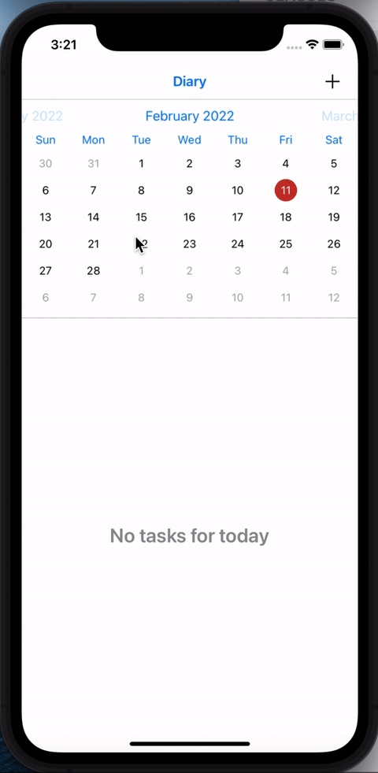

# TestDiary
### SimbirSoft bootcamp test app

  

> Don't forget `pod install` before running

**Features**

- Add, delete and edit tasks
- Fully programmatic approach
- VIPER architecture + Coordinator
- Emulation of loading data from backend (bundle JSON file)
- Realm for storage
- FSCalendar for calendar
- Unit tests for Main module business logic
